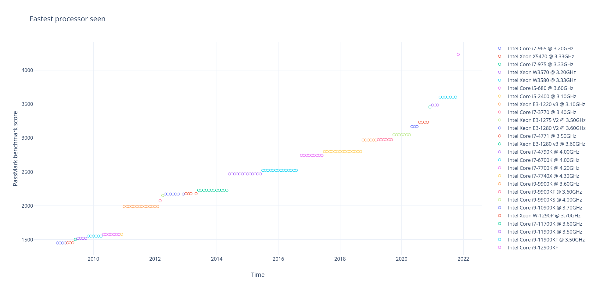
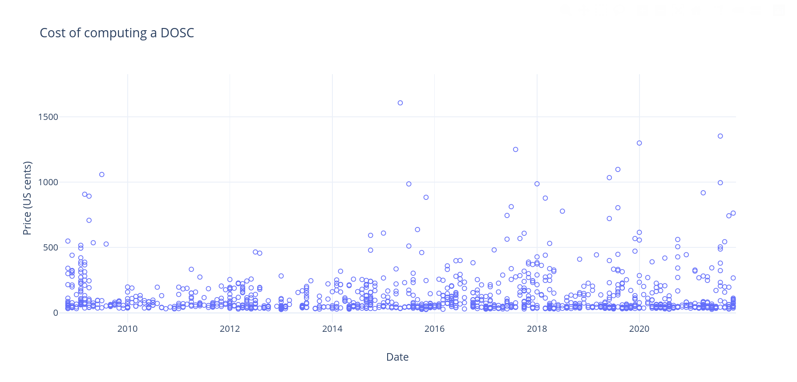

# Historical DOSC data analysis

## TL;DR

In Themelio, the native currency MEL is a fully trustless endogenous stablecoin pegged to a _DOSC_: a "day of sequential computation". The DOSC at a given time is defined as the cost of the computation that _the fastest processor at that given time can do within 24 hours_, a trustlessly measurable quantity.

The central conjecture of this pegging strategy, called Melmint, is that the DOSC retains a relatively stable purchasing power over time. The purpose of this repository is to validate that claim.

This is done by calculating the historical value of the DOSC using historical data on processor performance and price, combined with processor efficiency and electricity prices. Right now, the dataset is limited to Intel processors with retail prices listed on [Intel ARK](https://ark.intel.com), Intel's comprehensive catalogue of current and past products. Performance is calculated from [PassMark](https://www.cpubenchmark.net/) data. [FRED's data on US urban electricity prices](https://fred.stlouisfed.org/series/APU000072610) is used to calculate the energy component of computation price.

The following pictures shows the estimated price of a DOSC throughout the years, in US cents. Different colors indicate different choices for the "most efficient DOSC-calculator" --- this may not be the fastest processor at that given time, since using a slightly slower but much cheaper processor might be more efficient.

## Background

The key conjecture behind Melmint, as well as its predecessor Elasticoin, is the value-stability of a _DOSC_ (day of sequential computation). The DOSC is informally defined as the cost of 24 hours of sequential computation done on an _up-to-date_ processor. Anecdotally, this seems likely to be true --- single cores rented out at cloud computing providers seem to have costed 5-10 USD a month for at least a decade.

Unfortunately, a rigorous analysis is quite difficult. This is because "cost of running for a day" is not a metric people typically gather statistics on. Instead, "cost of computing X cycles" (dollars per million floating-point operations, etc) is usually what people care about.

Thus, as far as know, we can't directly read the value of a DOSC off of any kind of aggregate data source. Instead, we must indirectly calculate it based on performance and price data of historical CPUs.

## Detailed methodology

There are two separate questions to answer in order to determine the historical value of a DOSC. At a given point in time, we must know:

- **How much computation is a DOSC?** That is, with the _fastest processor available_, how much sequential computation can we do in a day?
- **How expensive is that amount of computation?** That is, how much would it cost to produce that much computation at that time, in the _most efficient way possible_?

### How much computation is a DOSC?

The first question is rather easy to answer. [PassMark](https://www.cpubenchmark.net/) gives detailed benchmarking results for a wide variety of current and historical CPUs, including single-threaded-only performance. Given this data, we can then deduce how much computation can the fastest CPU available at a given time do in a day, interpreting the PassMark numbers as an arbitrary unit. (We can do this because the numbers are proportional to sequential performance). This is graphed below:

As we would expect, as processors improve, the amount of computation a DOSC corresponds to steadily increases.

### How expensive is a DOSC?

Given how much computation is a DOSC, how expensive would doing that much computation be? This is a much trickier question.

We first formulate a way of estimating how expensive it is to run a given processor for a day. This has two components:

- **Depreciation**: the value of a processor drops over time. Thus, occupying the processor for a day inherently incurs a depreciation cost. In particular, we _very roughly_ estimate depreciation as a uniform 20%/year since the CPU was released. That is, after `k` years, a processor originally priced as `d` dollars would cost `0.8^k * d` dollars.

  We then estimate the depreciation cost of running a particular processor at a particular day as its estimated price at that day, minus its estimated price the next day.

  The hard part here is finding how much CPUs actually cost historically. PassMark doesn't give historical prices for most CPUs, instead only giving the _latest_ price, which is usually much lower for older CPUs. Instead, we use [Intel ARK](https://ark.intel.com) to find the release price of historical CPUs. This does limit us to Intel CPUs, which we don't believe to be a big problem because generally Intel CPUs are more efficient at sequential computation.

- **Energy**: the cost of the electricity required to run the processor for a day. This is estimated using the TDP figures in the PassMark data, combined with [electricity prices from FRED](https://fred.stlouisfed.org/series/APU000072610).

We can then combine this information with the speed of the processor to deduce how expensive it is to run a given processor until it finishes 1 DOSC worth of work. This is displayed in the graph below, where every data point is an individual processor model, with the cost measured at its release date:

### Getting what we want

We can now get what we want. At any given point in time, we search through _all previously released processors_ to find the most efficient way of computing a DOSC. That cost is then the "DOSC cost":

Note that the list of processors is different from the processors that define the DOSC. This is because using the very fastest processor is almost never the most efficient way of computing a DOSC --- instead, using a reasonably new but more efficient processor is generally the way to go.
