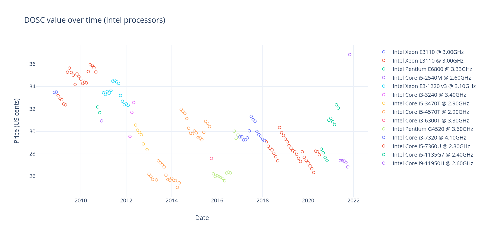

# Historical DOSC data analysis

## TL;DR

In Themelio, the native currency MEL is a fully trustless endogenous stablecoin pegged to a _DOSC_: a "day of sequential computation". The DOSC at a given time is defined as the cost of the computation that _the fastest processor at that given time can do within 24 hours_, a trustlessly measurable quantity.

The central conjecture of this pegging strategy, called Melmint, is that the DOSC retains a relatively stable purchasing power over time. The purpose of this repository is to validate that claim

This is done by calculating the historical value of the DOSC using historical data on processor performance and price, combined with processor efficiency and electricity prices. Right now, the dataset is limited to Intel processors with retail prices listed on [Intel ARK](https://ark.intel.com), Intel's comprehensive catalogue of current and past products. Performance is calculated from [PassMark](https://www.cpubenchmark.net/) data. [FRED's data on US urban electricity prices](https://fred.stlouisfed.org/series/APU000072610) is used to calculate the energy component of computation price.

The following pictures shows the estimated price of a DOSC throughout the years. Different colors indicate different choices for the "most efficient DOSC-calculator" --- this may not be the fastest processor at that given time, since using a slightly slower but much cheaper processor might be more efficient.

## Detailed methodology

(TODO)
